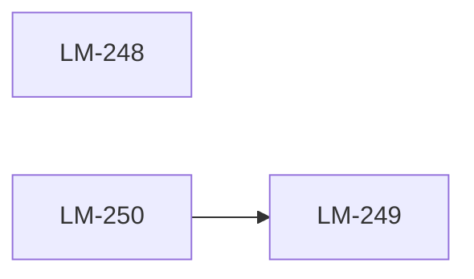
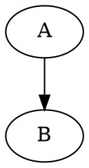

# Clawket strict plan-markdown format

The shape that `clawket plan import --strict` and the `ExitPlanMode` hook
will accept, and the shape that `clawket plan export --format md` emits.

This document is the **single source of truth** for the strict round-trip
contract (LM-248). The daemon parser (`daemon/src/import_plan.rs::parse_plan_strict`)
must accept exactly what's described here, and the CLI exporter
(`cli/src/main.rs` `pub mod plan { pub mod export }`) must emit exactly
this — no ambiguity.

The strict format exists so that:

1. Plan Mode output can be hard-validated by `ExitPlanMode` before it
   reaches the daemon (no malformed plans land in SQLite).
2. `clawket plan export … | clawket plan import --strict` is a
   byte-for-byte round-trip (modulo regenerated ULIDs).
3. Schema growth is gated — adding a 20th envelope field requires
   updating both this spec and `ENVELOPE_FIELDS` in lockstep.

If you don't want this discipline, **disable Clawket on the project**:

```bash
clawket project disable <PROJ-...>
```

That's the only legitimate bypass. Don't smuggle loose markdown through
strict mode.

---

## Section order (top to bottom)

A strict plan markdown document MUST contain these sections in this
order. Missing any section is a hard reject:

1. `# {plan title}` — H1, exactly one
2. (optional) plan description paragraph
3. `## Meta` block
4. `## Overview` table
5. `## 표기 규약 (Envelope 19 fields per ADR-0001)` — envelope legend
6. One or more `## Unit {idx}: {title}` sections, each containing
   `### {task title} ({TICKET}) — _{status}_` task headings
7. `## Dependency Graph` mermaid block (omit only if zero edges)
8. (optional) `## Milestones`
9. (optional) `## Knowledge` appendix

No other H2 sections are recognized. Unknown H2 → `BadHeadingDepth`.

---

## 1. Title (H1)

```markdown
# v11 — Structured Task Contracts
```

Exactly one `#` heading at depth 1. Multiple `#` headings → reject with
`BadHeadingDepth { line, hint: "exactly one H1 expected" }`.

---

## 2. Meta block

```markdown
## Meta

- id: `PLAN-01KQ4T97Y4PXR14S6XJ7R4GYD6`
- project: `PROJ-lattice-mono`
- status: `active`
- source: `docs/plans/v11.md`
```

Required keys: `id`, `project`, `status`. Optional: `source`.

- `id` MUST match `^PLAN-[0-9A-HJKMNP-TV-Z]{26}$`. New plans (signed by
  `ExitPlanMode`) may use a placeholder `PLAN-NEW`; the daemon mints a
  real ULID on insert.
- `status` MUST be one of `draft | active | completed`.
- Other keys are rejected with `UnknownMetaKey`.

Rejection examples:

```markdown
## Meta
- id: PLAN-...   ← MISSING backticks (kind: BadMetaValue)
```

```markdown
## Meta
- id: `PLAN-...`
- project: `PROJ-...`
                  ← MISSING status (kind: MissingMeta { key: "status" })
```

---

## 3. Overview table

```markdown
## Overview

| Unit | Title                  | Tasks | todo | doing | done |
|------|------------------------|------:|-----:|------:|-----:|
| 0    | Foundations            |     5 |    1 |     1 |    3 |
| 1    | CLI Execute / Replay   |    19 |    4 |     1 |   14 |
```

- Header row MUST be exactly the six columns above (case-sensitive).
- Right-aligned numeric columns use `---:` syntax.
- Row count MUST equal the number of `## Unit` sections that follow.
  Mismatch → `OverviewUnitCountMismatch`.

The exporter regenerates this table from live counts; the importer
treats the table as **advisory only** — actual task lists are sourced
from the per-unit `### task` headings, not the overview row.

---

## 4. Envelope legend

```markdown
## 표기 규약 (Envelope 19 fields per ADR-0001)

Each task below renders the resolved envelope (parent chain merged) as
a bullet list. Fields render in this canonical order:

- `version`
- `intent`
- `target_repo`
- `target_model`
- `max_turns`
- `prompt_template`
- `context_refs`
- `scope_boundary`
- `atomic_size_hint`
- `success_criteria`
- `verification_cmd`
- `depends_on`
- `blocked_by`
- `planned_sha`
- `decomposition_policy`
- `checkpoint_interval`
- `rollback_strategy`
- `origin`
- `assigned_model`

Fields not in this list are exported in `--format json` but omitted
from markdown bullets to keep the export stable.
```

The legend MUST list **all 19 fields** in canonical order, each as a
backtick-quoted bullet. Order matches `ENVELOPE_FIELDS` in
`cli/src/main.rs`. Mismatch on count or order →
`EnvelopeLegendMismatch { expected, got }`.

> Why duplicated here AND in code: the spec doc is the human contract,
> the constant is the machine contract. They MUST stay aligned —
> `cli/tests/plan_export_strict_spec.rs` asserts equality.

---

## 5. Unit + task sections

```markdown
## Unit 0: Foundations

**Goal**: Establish 19-field envelope schema and migrations.

### Schema migration for envelope (LM-20) — _done_

Optional task body markdown goes here. Multiple paragraphs allowed.

**Envelope:**

- `version`: 1
- `intent`: "Add task_envelopes sidecar table per ADR-0001"
- `target_repo`: "daemon"
- `target_model`: "opus"
- `max_turns`: 12
- `prompt_template`: "Create migration 002_envelope.sql ..."
- `context_refs`: [{"kind":"decision","id":"DEC-..."}]
- `atomic_size_hint`: "small"
- `success_criteria`: ["migration up/down passes","Envelope struct serdes round-trip"]
- `verification_cmd`: "cd daemon && cargo test envelope::"
- `depends_on`: []
- `decomposition_policy`: "atomic"
- `origin`: "RL-U2-07b"

### Next task title (LM-21) — _todo_

(repeat)
```

### Heading rules

- `## Unit {idx}: {title}` — `idx` is a non-negative integer; `title`
  is free text up to 120 chars. `BadHeadingDepth` if `idx` is missing
  or non-numeric.
- `### {title} ({TICKET}) — _{status}_` — required pattern.
  - `{TICKET}` matches `^[A-Z]{1,8}-[0-9]+$` (e.g. `LM-248`). Plan-Mode
    drafts may use `NEW-N` placeholders; the daemon assigns real
    tickets on insert.
  - `{status}` is one of `todo | in_progress | blocked | done | cancelled`.
  - The em-dash and `_..._` italic wrap are part of the contract.

### Body

Optional. Free markdown. Stops at the first `**Envelope:**` line or the
next `###`/`##` heading. Body content is preserved verbatim on
round-trip; whitespace at the trailing edge may be normalized.

### Envelope bullet block

`**Envelope:**` line followed by a blank line, then a bullet list:

- One `- \`{key}\`: {value}` line per field that has a non-null value.
- `{key}` MUST be one of the 19 names in §4. Unknown key →
  `BadEnvelopeKey { name, line }`.
- Order MUST match §4's canonical order. Out-of-order →
  `EnvelopeOrderMismatch { expected_index, got_index, name }`.
- `{value}` encoding:
  - **string** — JSON-encoded with surrounding double quotes:
    `"some text"`. Multi-line strings use a fenced YAML block scalar:
    `|` followed by indented continuation lines (4-space indent).
  - **integer / boolean** — bare literal: `12`, `true`.
  - **array / object** — JSON literal on one line:
    `["a","b"]`, `[{"kind":"task","id":"TASK-..."}]`.
  - **null** — DO NOT emit; omit the bullet.
- A field absent from the bullet list defaults per ADR-0001 schema.
- The required tier (per ADR-0001) — `version`, `intent`,
  `target_repo`, `success_criteria`, `verification_cmd`,
  `decomposition_policy`, `context_refs` — MUST be present. Missing
  any → `MissingRequiredKey { name }`.

Rejection examples:

```markdown
**Envelope:**
- intent: "..."        ← MISSING backticks around key (kind: BadEnvelopeKey)
```

```markdown
**Envelope:**
- `version`: 1
- `intent`: "..."
                       ← MISSING required `target_repo` (kind: MissingRequiredKey)
```

```markdown
**Envelope:**
- `target_repo`: "daemon"
- `version`: 1         ← OUT-OF-ORDER (kind: EnvelopeOrderMismatch)
```

```markdown
**Envelope:**
- `intent`: "..."
- `mood`: "happy"      ← UNKNOWN KEY (kind: BadEnvelopeKey)
```

---

## 6. Dependency Graph

```markdown
## Dependency Graph


```

- Fenced block language MUST be `mermaid`. Any other language →
  `BadDepsGraphFence`.
- First line inside the fence MUST be `graph LR` (no `graph TD`, no
  `flowchart`, no styling). Single canonical form for parser
  simplicity.
- Node lines: `  {id}["{label}"]` — two-space indent, ULID id, ticket
  key as label. Optional; declared for mermaid rendering only.
- Edge lines: `  {from} --> {to}` — two-space indent, single-headed
  arrow, both ids MUST resolve to a task in this plan. Unknown id →
  `UnknownDependsOnRef`.
- Cycles → `DependencyCycle { path: [a, b, ..., a] }`.
- The `## Dependency Graph` section is omitted entirely when the plan
  has zero edges. Empty mermaid block (with `graph LR` and no edges)
  → `BadDepsGraph { hint: "omit section if empty" }`.

The bullet `depends_on` value (in §5) and the mermaid edges MUST
agree. Mismatch → `DependsOnMismatch { task_id, bullet, graph }`.

Rejection examples:

```markdown
## Dependency Graph


```

```markdown
## Dependency Graph

```mermaid
flowchart LR          ← `flowchart` not allowed (kind: BadDepsGraph)
  A --> B
```
```

```markdown
(plan has 3 edges between tasks but)
                      ← MISSING `## Dependency Graph` (kind: MissingDepsGraph)
```

---

## 7. Milestones (optional)

```markdown
## Milestones

- M0 — schema freeze (LM-20) — done
- M1 — execute path online (LM-31) — in_progress
```

Free-form bullet list. Round-trips as plan body annotation, not as a
typed structure.

---

## 8. Knowledge appendix (optional)

```markdown
## Knowledge

### `u2-task-schema-inventory.md` (knowledge-...)

(content)
```

Each entry renders as `### \`{name}\` ({id})` followed by content.
Importer ignores the appendix on `--strict` (knowledge entries are
persisted via separate `clawket knowledge` commands). Exporter emits
it for human context only.

---

## Round-trip guarantees

The contract LM-248 closes: for any plan P,

```
clawket plan export --format md  P > P.md
clawket plan import --strict     P.md  --as-new
clawket plan export --format md  <new-id>  > P2.md
diff <(strip-ids P.md) <(strip-ids P2.md)   # must be empty
```

`strip-ids` normalizes regenerated ULIDs/tickets to canonical
placeholders so identity differences don't pollute the diff.

The same round-trip holds for `--format json` with `jq -S` for sorted
key compare.

Locked by:

- LM-254 — `cli/src/main.rs::commands::plan::export::strict_spec`
  (whole-document shape against this spec, run via
  `cargo test --bin clawket -- commands::plan::export::strict_spec`).
- LM-264 — `cli/tests/plan_export_roundtrip.rs` (export → import
  byte-for-byte parity, depends on the strict parser landing).

Either test failing means this spec and the code disagree — fix the
code, not the spec (unless an ADR amendment explicitly bumps the
contract).

---

## Cross-references

- ADR-0001 — `clawket/docs/adr/0001-execution-envelope.md` (envelope
  schema source of truth).
- `cli/docs/workflows/execute.md` — how to use envelopes once a plan
  is imported.
- `cli/src/main.rs` — `pub const ENVELOPE_FIELDS` (machine contract).
- `daemon/src/import_plan.rs::parse_plan_strict` — strict parser
  entry point (LM-258).
- `clawket/adapters/claude/exit-plan-mode.cjs` — Plan Mode gate that
  enforces this contract before plans land in SQLite (LM-260).
